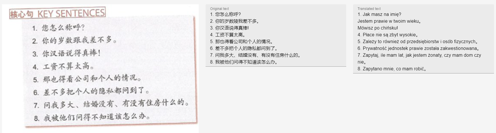

<h1 align="center">
    
</h1> 

<p align="center">
    <a href="#features">Features</a>&nbsp;&nbsp; | &nbsp;
    <a href="#used-technologies-and-tools">Technologies and tools</a>&nbsp; | &nbsp; 
    <a href="#getting-started">Getting started</a>&nbsp; | &nbsp;
    <a href="#screenshots">Screenshots</a>&nbsp; | &nbsp;
    <a href="#example-translations">Example translations</a>
</p>

Translate text from picture. Save translation and share it with others. Powered by Google Tesseract and LibreTranslate.

# Features
* translate text from picture using OCR technique
* save translation
* edit recognised and translated text
* share translation with other users
* supports 43 languages: English, Polish, German, Chinese, Russian, [more languages](https://libretranslate.com/languages)\

# Used technologies and tools
* Python 3.11
* PHP 8.2
* TypeScript 5.4.5
* Tesseract and py-tesseract
* LibreTranslate 1.6.1
* Backend: Laravel framework 11.7.0
* Frontend: Vue 3 with packages
    * tanstack-query (react-query)
    * vuetify
    * yup and vee-validate
    * axios
    * eslint and prettier
    * vite

# Getting started
1. Clone this repo
    ```
    git clone https://github.com/krzysztofhewelt/image-translator.git
    ```
2. Install Tesseract: https://tesseract-ocr.github.io/tessdoc/Downloads.html
3. Install all packages (Python)
    ```
    pip install -r tesseract/requirements.txt
    ```
4. Copy ``.env.example`` to ``.env`` in ``web`` directory. Set database credentials in that file
    ```
    DB_CONNECTION=mysql
    DB_HOST=localhost
    DB_PORT=3306
    DB_DATABASE=image_translator
    DB_USERNAME=root
    DB_PASSWORD=superpassword
    DB_COLLATION=utf8mb4_unicode_ci
    ```
5. If required, change LibreTranslate API, Tesseract path and Backend API endpoint
    ```
    APP_URL=http://localhost
    BASE_API_URL=http://127.0.0.1:8000/api
    TRANSLATE_API=http://127.0.0.1:5000
    PYTHON_INTERPRETER=C:\Users\Krzysiu\anaconda3\python.exe
    ```
    **Also change Tesseract path in ``tesseract/main.py``**
    ```python
    # Config
    pytesseract.pytesseract.tesseract_cmd = r'C:\\Program Files\\Tesseract-OCR\\tesseract.exe'
    ```
6. Run needed dependencies (Backend and frontend) and init backend
    ```
    composer install
    npm install
    php artisan key:generate
    php artisan jwt:secret
    php artisan migrate
    ```
7. Run LibreTranslate API (run command)
    ```
    libretranslate
    ```
8. Run backend and frontend server (**development mode**)
    ```
    php artisan serve
    npm run dev
    ```
9. App is running at ``http://localhost:8000/``.
10. In **production mode** copy all files to your HTTP server. Then compile frontend files using command ``npm run build``.

# Screenshots


# Example translations




